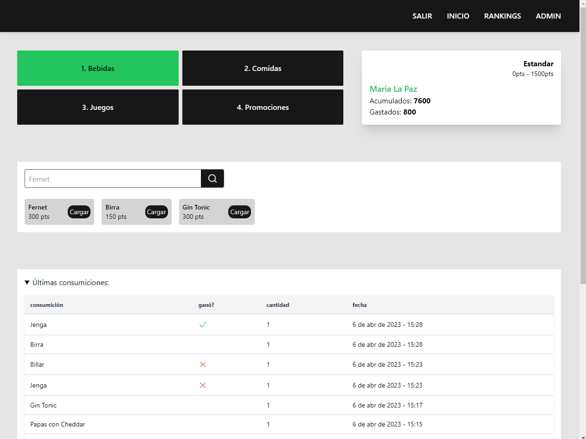
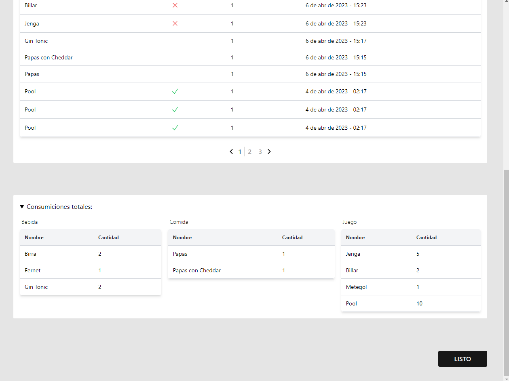
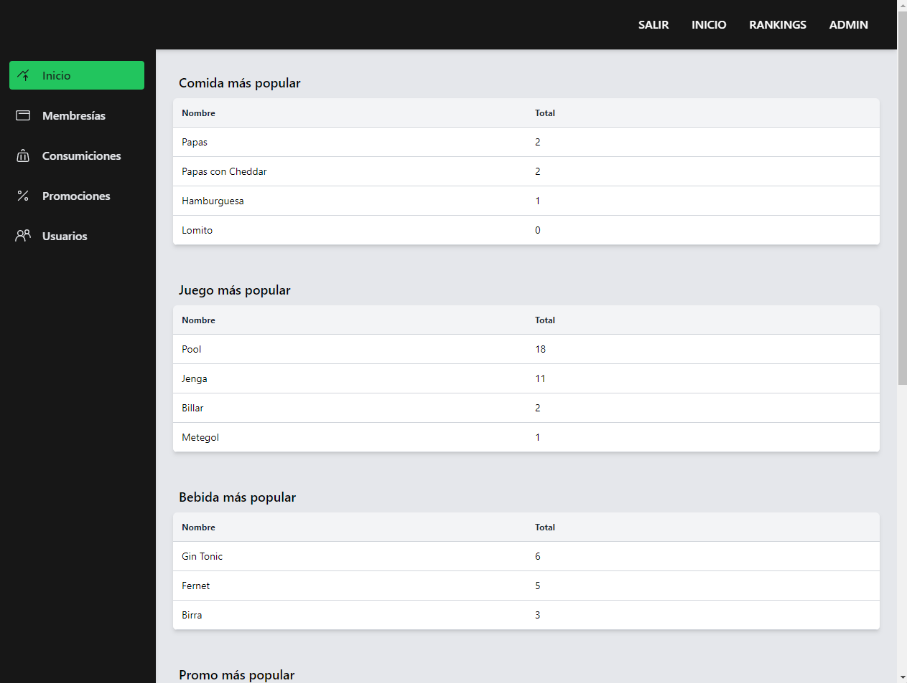
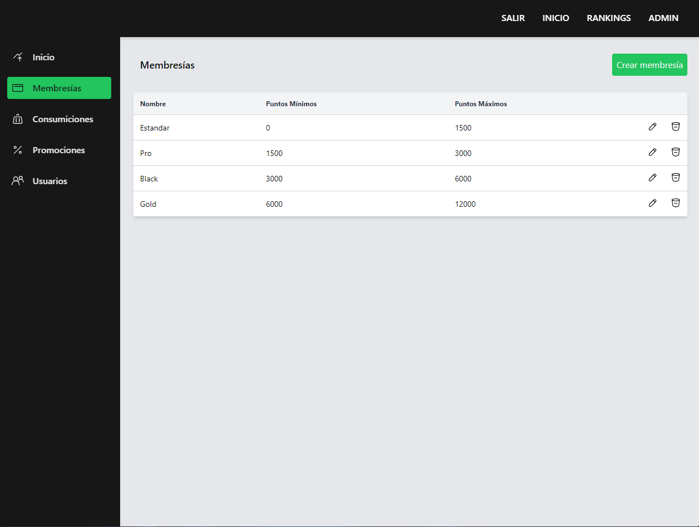
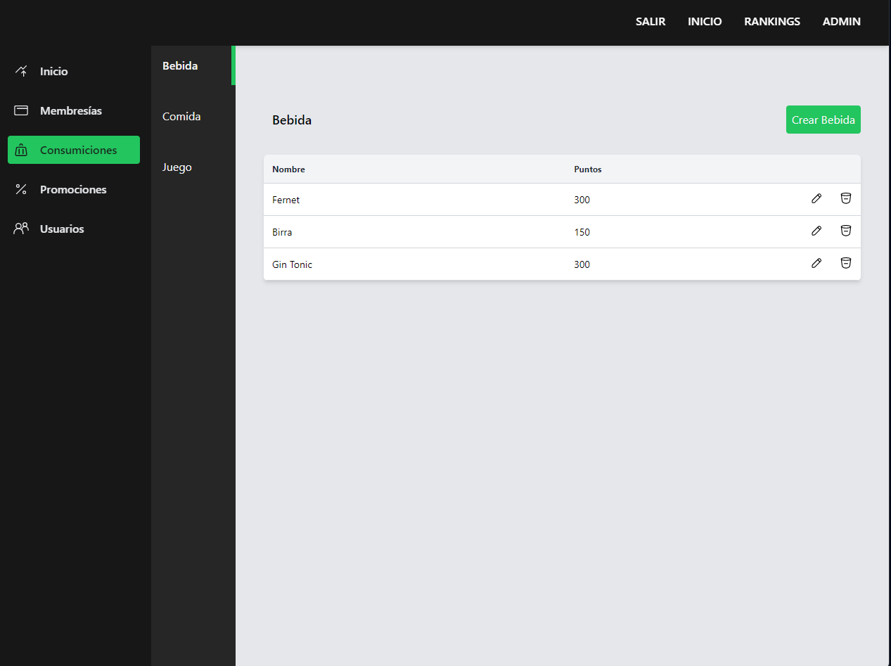
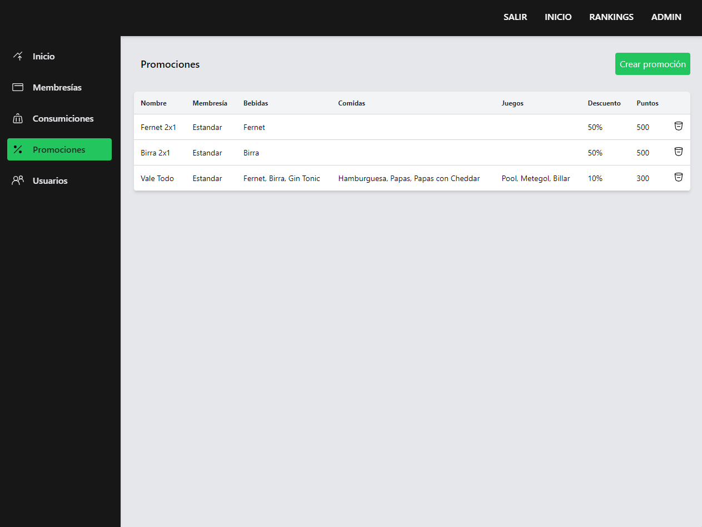
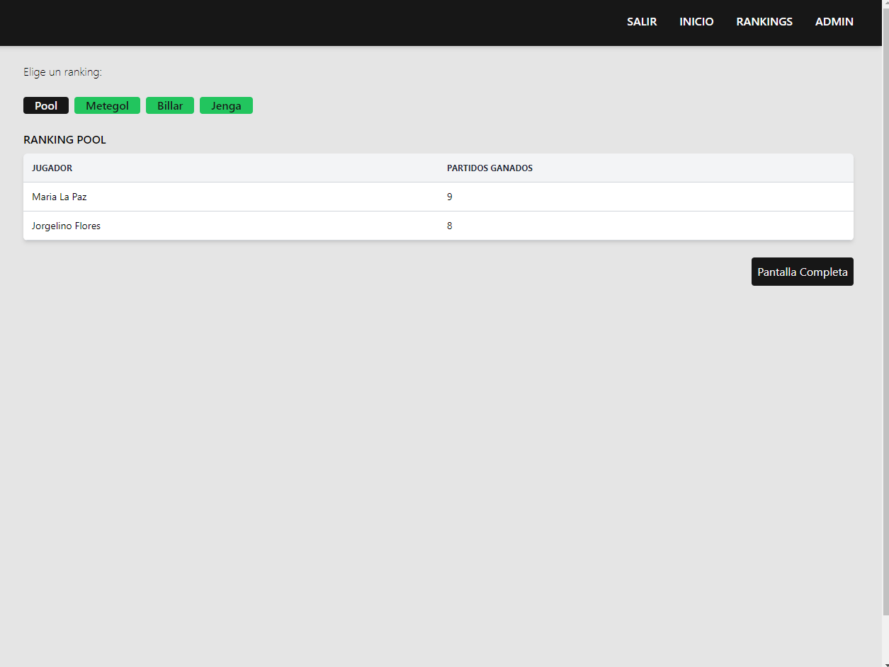

# BAR DE JUEGOS APP

Web para gestionar un bar con un sistema de membresías. los clientes pueden ganar puntos con cada consumición y luego canjearlos por promociones exclusivas según el nivel de membresía que tengan.

## Tech Stack

**Client:** Next.js, Typescript, TRPC, Tailwind, Socket.io

**Back:** Nextjs, Typescript, TRPC, Prisma, PostgreSQL, Socket.io

Socket.io esta siendo utilizado para el ranking de jugadores en tiempo real.

## Screenshots

